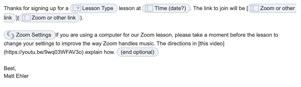

My district has just gone to distance learning, and I figured it was time to share some of my thoughts (that I’d originally begun formulating in the spring) about what I"m using to make the process as smooth as it can reasonably be.

In rehearsals, I find [Loopback](https://rogueamoeba.com/loopback/) to be really valuable. I can pipe in audio from Logic or [AnyTune](https://anytune.us) for students to hear. I’ve got a MIDI controller that I’ll use with Logic to give them individual notes, and with AnyTune I can easily adjust the tempo of the piece(s) we’re working on.

There’s obviously no great solutions for running rehearsals in terms of being able to hear the kids’ actual progress.

For lessons, I’m having students sign up through [Calendly](https://calendly.com). Calendly lets students grab a 20-minute block within the times I’ve set, but automatically filters out any times that I already have calendar events (as meetings throughout the day pop up). Once they sign up, it automatically adds to my calendar and I get an email notification, and the students get the same.

I then open the event on [Fantastical](https://flexibits.com/fantastical) and use Fantastical’s native handling of Google Meet or Zoom (depending on what students selected on their Calendly form). I have a TextExpander snippet that I send with the Zoom/Meet link along with a link to some quick [video directions](https://youtu.be/9wq03WFAV3o) for configuring Zoom audio to better facilitate a music lesson. I have another TextExpander snippet after a lesson that sets a template for their next assignment, and in the Spring it instructed them how to sign up for another lesson.

(I actually use Airmail’s Markdown mode so that I can totally avoid Rich Text snippets.)

If I were paying for Calendly, I could skip this step because it’d integrate with Zoom and add the meeting automatically, but I pay for Fantastical anyway, and I’ll take any excuse I can get to make some new TextExpander snippets.

When I was teaching general music last spring, I prepared an asynchronous video lesson each week. It was definitely overkill, but I used Final Cut Pro X to prepare the videos. I was able to use transparent .png files to overlay music notes over myself and transition them in on top of a video of me speaking. Using QuickTime’s ability to capture an iOS device’s screen, I did a video demonstration of what I wanted students to do in GarageBand. I also captured a bit of Dorico running on my screen to highlight some rhythms. To pipe the audio back in to the screen capture, I was using Loopback again. I also tried a bit of [Screenflow](http://www.telestream.net/screenflow/overview.htm) towards the end as well over QuickTime; there were compromises (using the free version) and it didn’t make showing my button presses as easy as I"d hoped, but it was okay.

I’ve tried Reincubate Camo, but I don’t really need a better camera. What I’d love is the ability to add an image overlaying my video when I’m on Zoom, and I’ve started to explore some of those rabbit holes. It might be more trouble than it’s worth, though.
