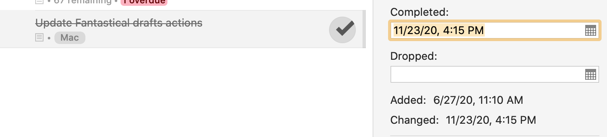

I absolutely love [Fantastical 3](https://flexibits.com/fantastical) and happily pay the subscription fee. One unfortunate part of its update though was a change to its URL schemes which broke the actions for it I was using in [Drafts](https://getdrafts.com). So today, I happily crossed off my to-do list updating the actions. The original actions were made by Greg (AgileTortoise) the maker of Drafts:

- [Drafts to Fantastical Event](https://actions.getdrafts.com/a/1eg)
- [Drafts to Fantastical Reminder](https://actions.getdrafts.com/a/1eh)

Really simple Drafts actions, but no one else had yet updated them on the Action Directory.

