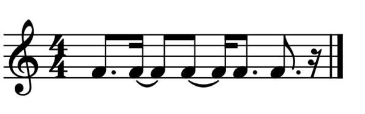

Last week [I tied up talking about subscriptions with why Sibelius is dead to me](https://mrehler.com/2021/06/30/on-subscriptions-part-two/). I’m going to make the case for Dorico being the daily driver for my fellow band directors.

This isn’t my attempt to do a comprehensive review of Dorico. I’d be wasting my time, because Scoring Notes has created an unsurpassable work doing just that.[1](#fn-233-1) If you haven’t read it before, I highly recommend their review of the [first version](https://www.scoringnotes.com/news/dorico-is-here-a-review/) of Dorico, as it explains what makes it so unique. They also have reviews of [every version](https://www.scoringnotes.com/?s=Dorico+review) of Dorico (v3.0 doesn’t show up on that page for some reason, [but they reviewed it too](https://www.scoringnotes.com/reviews/dorico-3-changes-the-score/)).

Instead, this is my attempt to talk about my use of it, and why I think it’s _the_ notation software to be using in 2021. I want to discuss why I hold that opinion, what I feel Dorico does exceptionally well, and what my complaints are about it as of version 3.5. First, I want to talk about my use of it — not to lend me any bona fides or credibilities (if you want to scrutinize what mine are, then just assume I have none) — but so that you, as a reader, can compare my use to your own needs.

## Dorico’s story and mine

If you’re not familiar with Dorico’s story, it’s somewhat interesting, and provides good context. Finale was released in 1988, and Sibelius was released in 1993. In 2006, Avid bought Sibelius, but kept most of the team it had at the time intact[2](#fn-233-2) before canning them all in 2012. That team got scooped up by Steinberg, a division of Yamaha and makers of popular DAW Cubase, who hired them to make a new big dog program in that space.

Not to get too mythical about it, but the Dorico team was able to ask themselves ‘what do we wish the 19 year-old program we were working on could do that was hard because of the fundamental assumptions that were baked into it from its birth?’ Or simply, ‘since we’re starting from scratch, how do we make the best thing possible?’

One amazing part of that story is the stewardship of Steinberg. The Dorico team was given the time they needed to cook the best 1.0 possible. Sure, it wasn’t complete with every feature yet, but it’s very rare to see that kind of work done. And but for one major complaint, Steinberg has been a much better steward of Dorico than Avid has been of Sibelius.[3](#fn-233-3)

I tried that first version of Dorico, and while I was impressed with it, it was a bit slow for me and while it was obvious there were a lot of amazing ideas right away, it was not yet the right answer for me.But[4](#fn-233-4) at some point in the 18-19 school year, Dorico Pro 2 had come out and I heard that their generous Crossgrade+Education offer was going to get less generous (it’s $200 today, which is still great and beats Sibelius’s $300 education price). At first, there were still some things I was doing in Sibelius that were easier there, but most things were miles better in Dorico, and my muscle memory quickly shifted that way.

I want to temper my recommendation, because if you have absolutely no problem with the software you’re using today, it’s probably not worth examining a switch…right now. Your existing files work best in the software you made them in, and it’s a pain to transfer. But computers are changing all the time and your next computer might not run your current software. If you’re a Finale user, getting current isn’t too painful, but if you’re a Sibelius user, [it is](https://mrehler.com/2021/06/30/on-subscriptions-part-two/). If you don’t have a current upgrade plan for Sibelius and you’re an educator, it’s cheaper for you to switch to Dorico. And it’s better over here.

## Noteheads and ties there and hair\[pins\]. Oh my!

So what’s better?

In both Finale and Sibelius, the model is fairly based on graphics and objects. In Sibelius, you’ve got your notes as one type of objects; You can apply “symbols” (like trills or caeusuras); You can put text on things (like dynamic markings and other “expressive” text, or tempo changes or regular text). You can put on lines (slurs, hairpin crescendos/decrescendos, and 8va lines). There’s some relative siloing between these ideas and how you interact with these things. Finale is similar in these regards, and the different types of “tools” represent these silos.

In Dorico, the model is based around the type of musical element something is, rather than how you’re going to make it or how the software is manifesting it. Text saying “cresc…” and a hairpin crescendo are both dynamics; one isn’t handled with a text tool and the other with a line tool. The program understands them as essentially different ways of representing the same thing, and you can actually toggle between them. It’s more intuitive, and they’re grouped with your other dynamic markings at the same time.

This sounds like a small distinction, but you become much better attuned to what you’re doing when you’re working on actual music. There’s far more examples than this, and that’s true of all the points I make — the Scoring Notes reviews are a much more comprehensive listing of these sorts of things if you really want to geek out over it.

## Opinionated Software

Dorico doesn’t want to understand things as symbols with limits defined by measures. It wants to understand everything as music. And because of that, it’s doing a lot of work _for you_ to adhere things to its understanding. If you start a bar of 4/4 with a quarter note and tie an eighth note to it, for example, it won’t give you a quarter note tied to an eighth. It’ll transform it into a dotted-quarter note.

Now there are definitely times you don’t want the software making decisions for you like that. Dorico lets you override that through the “force duration” trigger. Most other decisions can be overridden in the “properties” pane at the bottom of the screen. But Dorico would prefer you don’t have to override any of these settings on a case-by-case basis; it has amazingly in-depth options under its “Engraving Options” and “Notation Options” for everything it thinks you should want to change. Its defaults are really good, but you’re best off changing project-wide settings in here (and you can change them as a program default or just for a project).

I really value this for a number of reasons. First off, it helps me not make dumb mistakes. Finale and Sibelius will much more readily let you make whatever mistakes your heart desires. Feel like restating the same time signature in measures 3, 4, and 5? You may. But not in Dorico; it won’t let you put in redundant, unnecessary things that are bad engraving practices.

If you’ve ever explored any of the scores on [Musescore.com](https://musescore.com), you’ve seen some great examples of technically correct, but notationally abhorrent rhythms. In Dorico, if you type in a rhythm like that, it will automatically be corrected for you. For example in 4/4 if I input a bar of 5 dotted-eighth notes, this is what I wind up with from the defaults,

There are things about this that sometimes push back at the user — where the program’s handling falls short, there are very few ways to do any kind of workaround. It’s a truly noble goal that the program _shouldn’t_ ever fall short, and in actual practice, it does an amazing job of hitting the mark. Even if you’re working with a lot of more modern/contemporary practices — aleatoric notation, custom symbols for extended techniques — the program will meet your needs very well. But in its very few blindspots, you don’t get so much as a “hide this” button.

## Where it shines for educators — flows and layouts

While the aforementioned features are certainly nice and speed up my work, I think it’s the unique document model that makes Dorico shine for educators above other applications. Every separate file you are actually working with in Dorico is a “project.” Within each project, though, you can have multiple “flows.” These can represent any number of things; the archetypal example is different movements of a longer work, but creatively splitting things between flows lets a user make some pretty interesting things. For example, on a scale sheet, I could make each individual scale a different flow and handle the names of them at the flow level, rather than as text that I have to independently assign to each one individually. Or I could have totally separate musical examples on a worksheet. I could do the same thing in Sibelius by stretching out the space between the examples, but the program would be trying to reunite them if I made too many changes.

The other handy thing on Dorico is “layouts.” For regular usage, layouts are pretty easy to ignore the power of — by default, they’re just your full score and parts. But you can make layouts go very far for you. You can easily make custom scores that are maybe condensed[5](#fn-233-5) or feature only a few of the parts you’re working with. You can even assign different flows or parts to different layouts, which is something I’ve made creative use of for various playing assessment resources I wanted students to have. My two favorite examples of this I’ll be sharing later this summer — the chromatic scale pages I give to students, and the rhythm assessments I assign.

Using these features together with Dorico’s flexible (if sometimes a bit arcane) Engrave Mode, by totally breaking away from the defaults and making your own frames, lets you make some really incredible things with ease. This whole summer I plan to share a lot of resources and worksheets I’ve made that leaned on Dorico’s special features.

## Why I recommend Dorico today

Dorico’s got its strengths, but I think it’s worth comparing it to the other big pieces of software out on the market today to highlight why it’s the right choice for music educators.

Finale has just released its major upgrade in v27. It was the first program I learned to use really well, but I still think its downsides are really major. In v26, they made their **first** serious stab at automatically handling collision alignment. Sibelius’s Magnetic Layout has always been pretty good, but Dorico puts both to shame with how it handles collisions. Magnetic Layout can still be very fiddly, but in Dorico, the only time I ever find myself thinking about collisions are when I want the music significantly denser than it thinks to put in automatic line breaks. Finale is a lot slower to use than anything else today still; even drawing a slur or hairpin dynamics requires you to take your hands off the keyboard and use your mouse, even if you’ve taken the time to learn their “metatools” shortcuts.

Finale is _old,_ and they simply haven’t been making the investments in development to keep up with what their program needs. It’s constantly playing catch-up, with Finale 2016 being dedicated entirely to making the program 64-bit compatible. There’s a lot of what is called “technical debt” in the program. Old code, or code for old systems that would take a lot of actively invested time to revise for (likely) no immediate pay-off for the users. But paying down tech debt is a part of running a software business. It’s like home maintenance.

Now how is Sibelius itself these days? After hiring new developers, they’ve gotten back to some good, consistent updates, and have come out with some interesting new things. And Sibelius remains pretty fast at a lot of tasks. If I was captured by psychopaths who put a giant bomb in the building I was in and I was up against a timer to make great looking scale sheets as fast as I could or be blown to bits,[6](#fn-233-6) despite the fact that I know Dorico really well and haven’t used Sibelius for anything serious in probably two years now, I think I’d still choose Sibelius for that task.

There are things that Dorico does better than Sibelius, but there’s also areas where Sibelius shines in Dorico’s weak spots. Maybe for me personally, SIbelius would be a better choice on those grounds alone. But those aren’t the only grounds that I can evaluate the programs on. There’s of course the long-term trajectory of each application, but the bigger one is the [business model](https://mrehler.com/2021/06/30/on-subscriptions-part-two/). The only way I feel I could follow the path Avid wants me to go down is if Sibelius were the only application I’m using. Even if there’s some small ways that Sibelius has the edge, Dorico is too enticing to financially chain myself to Sibelius.

Outside of the big three commercial applications, there’s a whole host of other things to consider. Web-based tools like Noteflight and Flat.io are interesting, but I only see them useful for putting in front of students, not for making my own resources. MuseScore has [brought on some new talent](https://www.youtube.com/watch?v=qLR40BGNy68) and continues to get better, but I still don’t consider it up to the task of being a serious competitor with Sibelius or Dorico. It requires far too much manual adjustment and has too atrocious of defaults to quickly make anything I’m willing to put in front of a student.

## Honest Criticisms

As much as I do like Dorico, I also want to lay out where I have some complaints. At its launch, it didn’t have some of the features that most users would expect from its competitors from their long histories, but now that we’re five years in, I feel all of these complaints are fair. Dorico 4.0 should be coming out relatively soon, so when it does, I’ll check in on these complaints.

I really do love Dorico, I wouldn’t have this much to write about its problems if I didn’t.

### The two big ones

Two complaints stand above the rest, in its percussion handling and lack of templating.

Dorico comes with a handful of reasonable templates, but their support for templates ends there. You can’t make your own custom ensembles, which is a major pain at this point in time. You can store _some_ things, like a custom percussion kit, as files that you can later load, but even that feels like a half-measure when you should be able to have custom percussion kits available in your instrument list.

Dorico has so many different options, and you can save what you like as a new set of defaults. However, you can’t have multiple _sets_ of defaults to switch between for different projects, requiring you to remember how to reconfigure them each time. I’m not asking for an exact implementation of Sibelius’s “House Styles,” which is a really elegant way to store a bunch of options, font decisions, etc. at once. But this is one of the two things that I can’t believe isn’t better yet.

The other is all sorts of weirdness with percussion. I’ll start with the most egregious: Rolls. Despite all of Dorico’s smarts, including some harp pedaling intelligence and the ability to handle transposing figured bass notation, it doesn’t understand that percussion rolls work differently than tremolos. Dorico treats tied notes as a single note, which is generally how you want them, unless you’re writing a percussion roll. Because they’re a single entity, Dorico defaults to putting the roll on both parts of the note. To fix this, you have to go to a different mode (engrave mode) and untick a box that requires horizontally scrolling over for each instance. One of these days I’ll make a macro for this, but it pains me having to do this at all.

The percussion pains don’t end there, though. Dorico makes putting in cues a breeze for any other instruments, but if you’re dealing with unpitched percussion, you can’t put in a pitched cue. It also doesn’t extend its smarts to making flams look halfway decent by default. And drum set parts can be a mess in terms of how it handles voices.

There are percussion strengths — it’s very fluid in moving between a five-line staff, a grid, or single line instruments in different layouts — but actually writing percussion parts feels like a chore.

### Engrave Mode and Learning Curve

Engrave Mode is very powerful, and I feel it lends a lot of flexibility. I also think it needs some rethinking. If you’re familiar with a program like Adobe InDesign, you understand things like Master Page Sets, but following the Facebook group for Dorico, it’s clear that it’s a barrier to entry.

Having done some really powerful stuff with Engrave Mode leaves me wanting several things it doesn’t currently have. The first is the ability for guides to snap with frames — dealing with the numbers in the properties tab is not an effective way of doing things for me, and requires a lot of math. I also wish that there were a way to more easily see your changes in the massive options panes (Engraving Options, Notation Options, Layout Options…) in the parts you’re working on as you’re tweaking them. There are ways to do this with multiple windows or monitors, but I’d like to not need a special set-up for it. The Sibelius ribbon is…well, contentious, but seeing my staff size update live helped make informed decisions on my 13” screen.

All notation software has a learning curve, and Dorico is no different. Because it wasn’t my first application, I can’t judge how hard it _really_ is, but I think it’s important for Steinberg to be really cognizant of. The new properties settings of “local” vs “global” changes were hard to get my head around, and I still find myself going to [Scoring Notes](https://www.scoringnotes.com/reviews/dorico-3-5-review/) for clarity on all sorts of things. Steinberg has a _lot_ of videos on [their YouTube channel](https://www.youtube.com/c/dorico/videos), but if I were advising someone new on how to learn Dorico, I don’t know where I’d start in terms of their videos. I don’t know if it’s possible to make a feature like Frame Chains intuitive, but it definitely required a trip to [the documentation](https://steinberg.help/dorico/v3.5/en/dorico/topics/engrave_mode/engrave_mode_music_frame_chains_c.html) for me.

There’s a number of other things in Engrave Mode that are particularly unfriendly or don’t work _quite_ right. Flow headings have a [mind-boggling behavior](https://forums.steinberg.net/t/funky-flow-headers-two-column-layout/136477/2) if you’re getting particularly creative with the way frames are laid out rather than following the order you’ve laid out in the frame chains. Selecting objects to make into a single system sometimes feels fragile as to what you actually have selected. Smaller things, but still important to get right in my book.

### Keys to the Kingdom

Out of all the complimentary or critical things I have to say about Dorico, this might be the one that more people disagree with me on than any other: Dorico doesn’t have enough actions bound to keyboard shortcuts _by default_.

I’ll be clear, it has a lot of them bound! Every popover (for putting in dynamics, or a tempo, or a repeat…) has a good keybinding. Toggling important options on and off in write mode has good bindings. But if you look at the open keys on the keyboard, there’s a lot of territory that they didn’t try and bind, and a lot of important actions that don’t have a default binding.

Now I’ll be even more clear: Dorico does a perfectly fine job of letting you bind keyboard shortcuts. You can bind just about anything you want — all the things I’m most grumpy about not being bound by default are all in the regular menu for keyboard bindings. And if you follow some advice from some power users, you can even bind some macros yourself.

_”So what are you actually complaining about?”_ you might be asking.

I love to bind my own custom shortcuts. In fact, [my most popular blog post is on a set of keyboard shortcuts that I think makes Sibelius vastly better](https://mrehler.com/2018/01/12/using-sibelius-on-a-laptop/). But the lack of existing keybindings make it harder to intelligently bind my shortcuts in a way that sticks.

You see, Dorico is still evolving, much more than Sibelius or Finale at this point. Each major version release has added some great new features that require some new keyboard shortcuts that they’ve happily bound. But because there’s such a wasteland of unbound keys, I don’t trust that anything I bind myself won’t get overridden in the next major release.

You might say that part of that is silly, as they could just as easily revise their own bindings from version to version. You’d be right, but I could at least take cues from how they’ve moved things around to find new places for my own shortcuts.

I’m serious in this being an actual problem, by the way. Part of using music notation software efficiently is learning the shortcuts, but in Dorico, there’s an awful lot of important things not bound. Things like the sub-modes within the Engrave mode _need_ to be bound. It’s one thing to expect your power-users to change the bindings, but it’s frankly a cop-out to leave so many things unbound. These are decisions that should be made by the developers. Undecided decisions are a shortcoming in your design; after all, to [quote a guy](https://quotesondesign.com/steve-jobs/) who was an okay semi-successful designer: “Design is how it works.”

I’ve personally been paralyzed for the last three years in getting a great shortcut flow down for myself. I’ve made some custom bindings, but other things occur to me as needing a binding, with no obvious thing to bind them to; not enough of an existing framework to use as the basis for any major reworking of the shortcuts myself. It’s bumming me out. Once I have some better shortcuts to share, though, I’ll share them. But I’d be much happier if Steinberg took a step first in setting more up.

## Misc

There’s a number of complaints that I’d originally laid out in my outline quite some time ago that are no longer relevant. I had some complaints about the lack of fonts available, but that’s gotten substantially better just in the last year. I also was going to take a (very fair) jab at how atrocious the Steinberg eLicenser is, but they’ve [recently announced that they’re doing away with it](https://twitter.com/SteinbergMedia/status/1367421306837344257), and not a moment too soon. Even if it’s there today, it’s on the way out very soon.

There were a few last things I wanted to touch on that I couldn’t fit anywhere else. The first is Insert Mode which is mostly a blessing, but carries some danger with it. When I’m doing a transcription of something, it’s very easy to jump over a measure or even a line. Then you have to cut and paste the whole bit you were just on…and not with Dorico you don’t. You can just jump back to where you diverged, hit the “insert” mode trigger, and just like in a text editor or word processor, the things ahead of it will move where they need to be.[7](#fn-233-7) The only issues that pop up are for brand new people who mistake it for the button to start inputting notes at all (and I was personally quite a bit perplexed with getting note input started once upon a time).

Finally, I want to mention the videos of [Tantacrul](https://youtube.com/playlist?list=PLI2ajxD5tIRD2ilTHXY7XXNWtaSk3xtArl) on all the notation software. He has some legitimate digs at Dorico, though thankfully the worst are getting better with the changes to the eLicenser. Properties mode can still be a bit fidgety, and I will occasionally get a bit frustrated with handling players from time to time in Setup mode.[8](#fn-233-8)

In spite of my complaints, I can’t recommend Dorico enough to my fellow educators. If any reasons are starting to accrue for leaving Sibelius or Finale, you should really look at jumping over. Steinberg mentioned when v3.5 shipped in 2020 that they were hoping to move to a spring release schedule…working from home during COVID is probably the culprit of v4 not being out yet, but I’m eagerly expecting it any day now.

If you have any questions about Dorico, I’d be happy to answer them, or maybe write about them — I’m [@\_ehler](https://twitter.com/_ehler) on Twitter. I plan to be posting some projects I’ve made in Dorico to give other people ideas and things to steal throughout the remainder of the summer. I recommend picking up [Dorico SE](https://new.steinberg.net/dorico/se/) for anyone who doesn’t already have a full version of Dorico (though their trial is pretty lucrative.) The [Facebook group](https://www.facebook.com/groups/1725110804433331) and [forums](https://forums.steinberg.net/c/dorico/8) are great resources out there for anyone trying to get a handle on it.

For anyone from Steinberg reading this[9](#fn-233-9) who spotted a mistake I made, I will happily correct it as I [previously have](https://mrehler.com/2020/01/16/dorico-3-se-announced/).

* * *

1. In this post I believe I will levy a lot more complaints than they do; just a different tone and a different set of goals. Read their dang reviews. [↩](#fnref-233-1)
2. At some point in this timeline, the founders, Jonathan and Ben Finn moved on from the company. I don’t have an exact idea of when certain people began at the company and when others left but we don't need to get any more bogged down in this. [↩](#fnref-233-2)
3. For those wondering, that complaint is the eLicenser that I touch on later. It’s worth noting that Avid’s DRM has gotten much, much worse since 2012. [↩](#fnref-233-3)
4. I tested it pretty thoroughly too; I’d recommend anyone kicking the tires on new notation software do so by transcribing something off of IMSLP. I did a [Saint-Saëns bassoon sonata](https://soundcloud.com/mrehler/funky-saint-saens). Try something with piano for sure, because playing with voices/layers is key to getting a feel for a program [↩](#fnref-233-4)
5. And Dorico’s condensing and cue features are incredible. Scoring Notes covers this well. Are you noticing a theme? [↩](#fnref-233-5)
6. Yes this is a practical consideration to think about. [Also…](https://www.youtube.com/watch?v=P0f4pljWdfw) [↩](#fnref-233-6)
7. Yes, even if there are triplets. [↩](#fnref-233-7)
8. I also wish I could get most instruments not to write out their transposition by default in the part layout name. There are ways to do this in the score, but I don’t need "(B flat)" written in the file output for every clarinet and trumpet part. [↩](#fnref-233-8)
9. They have a commendable social media presence, including John Barron of Steinberg is actually very active on their Facebook group answering questions and Daniel Spreadbury going on the Scoring Notes podcast frequently. [↩](#fnref-233-9)
