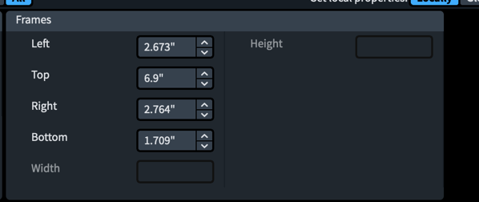
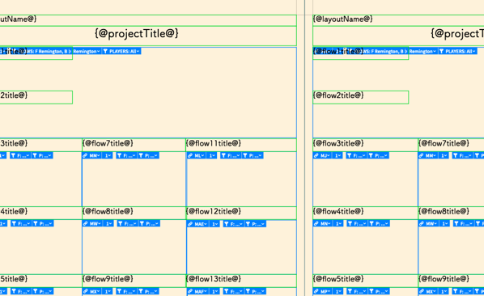
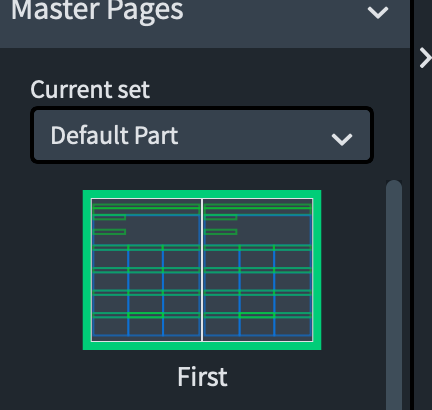

This resource page is the source of a lot of where I’ve come to believe Dorico can improve the experience with Engrave Mode, particularly with frames being able to have ‘guides’ or snapping like many other applications offer. It’s also where I encountered the absolutely bizarre [Flow Heading assignment behavior](https://forums.steinberg.net/t/funky-flow-headers-two-column-layout/136477/2).

The goal with this sheet was to provide a written out example of a Remington (both on concert F and concert B♭) as well as the chords for every scale. Some of my students weren’t grasping the idea of a Remington right away (leaving out tones, etc.) as they hadn’t done them with the previous director. I also wanted a major triad stretching across the range of their instrument to allow us to later do chordal Remingtons after each scale in a warm-up. There might be an unnecessary/unhelpful excess of notes that I could pare down, but this was just the first version to revisit later.

The way I wanted to lay this sheet out made it pretty tricky. I thought Dorico’s frames features would make it easier than it ultimately did, but in reality, I had to do a ton of math and remembering numbers in the properties panels for these frames to get it lined up even halfway decently. This is where some guides or snapping would’ve really been handy.

I had each chord as a separate flow and had a pretty easy time of just setting every instrument’s notes across their range from the score itself. I assigned each flow into a separate frame chain (which itself could maybe be a faster process) but what really threw me was the flow headers were all assigned seemingly at random until I figured what was up. I then manually had to set the text frames too, assigning one for each flow’s title.

Thankfully, I only had to do this arduous process once for the master page layout, but I still think it should’ve been easier. In any other application, it would’ve been equally hard in different ways — making staves invisible, keeping system text titles of chords from floating away, and having to fuss with inconsistencies between different instrument parts.

Here’s the [project file](https://www.dropbox.com/s/olwal0nr9z73t21/Ehler%20Blog%20Remington%20%26%20Chords.dorico?dl=0) and the [individual PDFs](https://www.dropbox.com/s/fwju3m1gurydo5a/PDFs%20of%20Remington%20%26%20Chords.zip?dl=0). You're best off doing any edits from the score, rather than an individual part. Sorry for any font weirdness.

Here’s my boilerplate from previous posts: For anyone curious on playing with the project file who doesn’t have Dorico, pick up [Dorico SE](https://new.steinberg.net/dorico/se/) — or now the new [iPad app](https://apps.apple.com/us/app/dorico-compose-music/id1556625090) . I didn’t test these files in SE, but I think you can get the gist using it. As I recommended in my [big Dorico post](https://mrehler.com/2021/07/06/notareview-of-dorico/) , the trial is worth grabbing.

I’m not sure if I’ll have any new resources next week as summer wraps up, but I wanted to share these resources with other educators for them to be able to put to use in their classrooms and to give them ideas of what Dorico is able to do with some of the features that make it unique from other notation applications. To provide a more permanent home than these Dropbox links (though I don’t plan to deactivate them ever) I’ll be following up before long.

* * *

I did want to drop one other quick note on Dorico for iPad with this post.

Software development is hard, and business models take a lot of consideration. Many software companies are like a large boat, seeing the currents of the market and their customers’ needs, but taking time to pivot.

Twelve long days after Dorico for iPad launched, they’ve [removed the 12-player limit for subscribers](https://www.scoringnotes.com/news/dorico-for-ipad-1-1-removes-player-limit/), thus solving the #1 limitation I [felt the app had](https://mrehler.com/2021/07/30/dorico-transposition-and-ipad/). It’s great to see the Dorico team responding so quickly to customer needs, and to have the app become so much more valuable. At $40/yr, it’s a no brainer. It’s still not Dorico Pro as it exists on the Mac, but it’s a vastly more capable application than it was two weeks ago when it launched — and at launch it was already an amazing experience.
