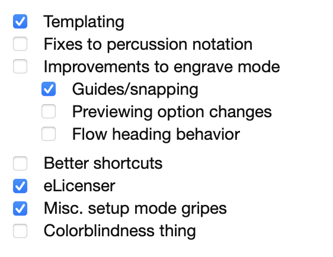
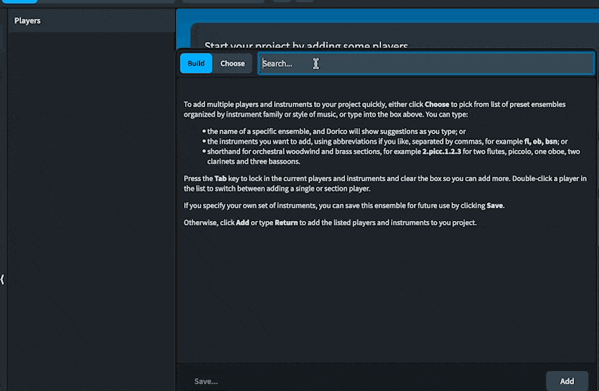

Dorico 4 is out!

What I want to write about it isn’t a review. If you want a real review for it, you should read the [excellent one over on Scoring Notes](https://www.scoringnotes.com/reviews/dorico-4-review/). It’s the most comprehensive look aside from just reading the version history document.

If you want my review, it’s short and sweet: this is a great release, and you should buy it.

Instead of pretending I could give a review that would be worth your time in light of Scoring Notes’s, I did want to touch base on [some of the things I griped about previously](https://mrehler.com/2021/07/06/notareview-of-dorico/) and just follow up on where some of those things are with Dorico 4. It’s not an objective or even fair measurement of this release _as a release_ – which is what differentiates it from a review. But I want to acknowledge where they’ve made important progress and have to look at the areas they haven’t in the same breath.

I’ll acknowledge that I have had a chance to test this version of Dorico ahead of time, which also means that I received it for free. Which itself means that I’m of course totally in the bag for Steinberg and no longer a trustable source on any of this.[1](#fn-272-1 "Read footnote.")

As a quick summary of the things I mentioned:

### Templating

The Dorico team has really done a great job with the new templates, and to me they’re one of the headlining features of this release. It goes beyond the bare minimum that many of us would have settled for – it does a great job of handling things like font and even certain layout options in a template itself. I was able to pretty easily set my blank file for [rhythm assessments](https://mrehler.com/2021/07/13/dorico-rhythm-assessments/) to a template with flows included. Check the SN review for more on the Library Manager features to better understand the depth of these features.

### Engrave Mode Improvements

My checklist is actually a bit generous here, but I really appreciate one refinement in Engrave Mode that’s so subtle, I didn’t realize I’d been using it and benefiting from it until I heard Daniel Spreadbury (Lord of the Dorico-verse for anyone unfamiliar) mention it as one of his favorites. There’s now what he calls a “crosshair” when adjusting frames, and that makes all sorts of layout and alignment work absolutely delightful. I don’t know what a guide feature exactly looks like in my head, but in practice, this is everything I want a guide feature to be. Daniel has mentioned true snapping might be down the road as an extension of this feature. I’m now totally satisfied in this particular itch, though.

### eLicenser is Dead

Ding dong! I mentioned that it wasn’t long for this world, which was public knowledge when I last wrote about it, but now it’s officially dead! And what replaces it?

The Steinberg Activation Manager looks nice and is mostly out of the way. Having been on the beta, I assume I’ve had vastly more interaction with it than someone on public releases. While it’s fully baked, it is worth noting that Dorico is Steinberg’s first program on this new system, and it’ll probably have some further revision as they add it to new releases of Cubase, Nuendo, WaveLab, et al. I don’t expect that’ll make for a worse Dorico user experience in the slightest.

Importantly, where with the “software” eLicenser before, you could only use Dorico on a single machine (and it required a USB dongle for a second machine) the new SAM allows you to use it on _three_ machines. Great stuff. For more details on it, [check Scoring Notes’s coverage](https://www.scoringnotes.com/news/dorico-4-planned-for-early-2022/)

### Setup Mode Behavior

I vaguely griped about setup mode in my previous post, but there’s some really strong progress here that will be even better as it’s further realized.

It’s much faster now to add instruments to a score (or as Dorico conceptualizes it, _players_, which is meaningful in how it intelligently handles instrument switching). It’s much faster now when using a feature called the “ensemble picker.” The SN review mentions this, but I think a GIF makes things much clearer quickly:

Further improvements on this feature are going to make life even easier, but for most band users, you’ll want to make `⇧E` your new favorite shortcut in Setup Mode.

There’s a new default that band people will want to be aware of, and that’s the fact that new instruments get added in orchestral score order. That most importantly means that your horns will go in the wrong place (in a band score, horns should always go after trumpets, while in an orchestral score, they go before). Band score order is likely coming though, and the [forums](https://forums.steinberg.net/c/dorico/8) are a great place to give input on this. I sat down with a full list of every Dorico software instrument that Daniel provided to me and got a start on it, but aside from making some assumptions about where a Zink goes in a band score, I wasn’t very confident in a good order for many percussion things with the time I was able to commit to reordering things.

### Closing Thoughts

This is all just a comparison of what I’m still wanting Dorico to be against what it just became with the release of Dorico 4. This isn’t getting into the many great new features added that I couldn’t dream up. For those who care a great deal about the way things sound coming through, there’s major enhancements to Play Mode. For anyone using this with students (or even for yourselves) the new Key Editor (read: Piano Roll) will prove to be a valuable added dimension for working with the music right in Write Mode. The new Insert options give a lot of added flexibility to one of my favorite Dorico features. It’s a great release, and you should hunker up with the Scoring Notes review as soon as you have time.

I also didn’t mention that this release is now a “Universal Binary” on the Mac, which means it takes full advantage of the M1 chip’s power. The only downside is that many audio plug-ins (including NotePerformer which I quite like) are not, and require you to manually run the app in Rosetta (nullifying that benefit) for compatibility. I can only guess, but I assume NotePerformer will become a universal binary some time between now and June.[2](#fn-272-2 "Read footnote.")[3](#fn-272-3 "Read footnote.")

I won’t pretend that every feature I care about on this checklist is mission critical for every band director.[4](#fn-272-4 "Read footnote.") I just wanted to touch base on these issues; because this is already getting a bit long, I won’t even go to the effort of restating the issues that still stand today; anyone who cares has to go read my old post on it. The team at Steinberg has done a great job with this release, and I’m excited for the point releases to follow and everything that’s still to come down the road. The timeline of the Steinberg Activation Manager, the iPad release, and, oh yeah, COVID-19 made this release a little farther away than the team at Steinberg has intended them to be relative to their ideal release cadence, but it’s been worth the wait. Everything else on my list can wait for Dorico 5.

* * *

1. I shouldn't have to specify this is sarcasm, but I know we're on the internet and it's 2022, so… [↩](#fnref-272-1 "Return to main content.")
2. And I now have an M1 Pro MBP, which I absolutely adore} [↩](#fnref-272-2 "Return to main content.")
3. The team behind NotePerformer is great, and you’re a jerk if you get mad at them for not having a Universal Binary or put any stock into my guesses [↩](#fnref-272-3 "Return to main content.")
4. I think fixes to the percussion notation actually are a huge day-to-day deal for most directors and band arrangers looking at Dorico [↩](#fnref-272-4 "Return to main content.")
