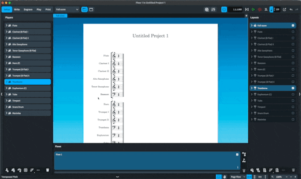

[Dorico 4.0.10 came out today,](https://blog.dorico.com/2022/02/dorico-4-0-10-update-released/) ([SN post](https://www.scoringnotes.com/news/dorico-4-0-10-update-is-available-trial-version-and-ipad-update-to-follow/)) which, as [befitting an X.0.Y release](https://semver.org) is mostly bug fixes. I normally don’t write about any point updates for Dorico, but I felt the need to follow up on one thing from [my post just a few weeks ago on the release of version 4](https://mrehler.com/2022/01/12/revisiting-my-dorico-criticisms-in-light-of-dorico-4s-release/) with the exciting news that Dorico’s score ordering feature now supports band score order in addition to orchestral score order!

## Using Band Score Order

It’s a little tricky to find the band score order toggle; you do so by **right-clicking** the sorting icon at the bottom of the left-pane, which will give you options between different score orders (leaving room for more to come).

If you set that right from the start, then as you add instruments, they’ll appear in the correct order. If you unwittingly were working in orchestral score order first and need to then adjust, simply switch it over to band score order and then left click the same icon again to have it impose that score order on your players.

 It may behoove you to then renumber the layouts (in the Setup dropdown menu)

## From Here

I had the privilege of getting to help with this list, but my own self-doubt when helping order all 610 instruments in Dorico for band and the lack of any single authoritative source on the matter means that an adjustment here or there might eventually be made by the smart team over there.

It peeves me beyond all belief when anything is mis-ordered in a score. Horns above the trumpets are an obvious offender, and percussion (which is mostly the same with orchestral score order) is also particularly irksome. It was a fun project trying to find sources, and if I were made of time, I wouldn’t mind taking a trip to just pull a bunch of scores and try to find what has actually been done with oddball instruments that almost never make it into a concert band. But this new feature will hopefully be of use to everyone who writes for band in Dorico – at the very least saving them the clicking and dragging on every new score to fix where horns and bassoons should be.
