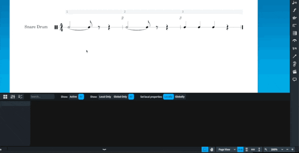
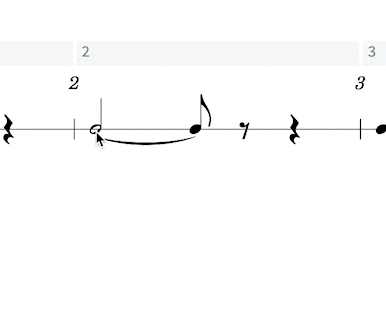
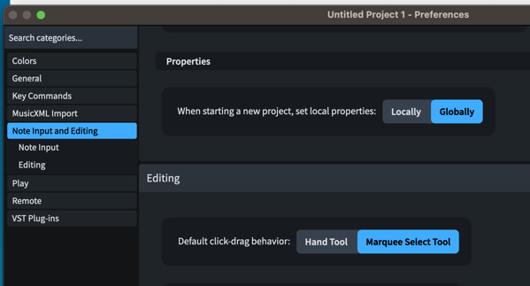

I’m Ehler, and I love to complain. Dorico 4.3 is now out, and those folks at Steinberg have taken away things for me to complain about.

The biggest thing for me – and I imagine, most people who ever write for percussion – is a new “tremolo” behavior that is very useful when writing percussion rolls. Because Dorico understands two notes tied together as _one_ note in actuality, applying a tremolo to the first note in a tie chain applied it to the last note as well. Many percussion rolls, however, need to show the final note without any tremolo slashes. Prior to 4.3, this would require a trip to engrave mode to disable the single stem tremolo property on the final note in a tie chain.

On its own, not particularly cumbersome. But this is a very common way of writing rolls, and in a given snare part, one may have to do this dozens of times.

The new method is much better. No changing modes, no properties panel. Just adding `rel` at the end of your tremolo input in the “Create Repeat” popover (e.g. `2rel` or `//rel`) omits the tremolo/roll slashes on the final note.

This, to me, is really the biggest improvement that percussion part writing needed in Dorico, and is most welcome. This one change is the highlight to me of a very meaty update. I won’t even talk about the impressive chord realization features, mostly because [you should read David MacDonald’s post on Scoring Notes instead](https://www.scoringnotes.com/reviews/dorico-4-3/), but also because I’ve got two other things to gush over.

The first is a small change that will save me a lot of headache, and is kind of hard to understand. In most projects of any type, I do most of my writing in the score rather than the parts, in page view. As a result, when I need to change something from its default option via the properties panel I change it in the score. But Dorico has had for some time the concept of “local” and “global” properties – whether the property change should apply just in your current view (e.g. in the score but _not_ the part) or everywhere it can be affected (in both the score and the part). There are times changes in one but not the other are definitely desirable, but the end result has been me forgetting to click the global button before making changes for years now and then having to go back and click all those properties again.

They have now let you change the default behavior. The only downside at all is it was a bit hard to find, and I had to pull up the version history to find it. Under the main preferences (`⌘,` on Mac), Note Input and Editing, it currently resides as the final entry before the “Editing” section

If the description of what this does made no sense to you, then you’re probably also the kind of person who should turn this on.

The last exciting feature of this release is the addition of some new commands and properties: Hide notehead and hide stem. These will allow easier creation of new kinds of worksheets for educators, I’m sure. This last summer, I had a handwritten resource from another educator from a jazz symposium I was given that I was excited about possibly using. Being a gigantic nerd, though, I was trying to think through how to make it in Dorico and was a bit disappointed that I couldn't come up with good ways to do so. Before 4.3, I’ve now been convinced that it’s possible – [over on Scorico, Hanneke Hommes has a series of worksheets](https://scorico.net/downloads/theory-worksheet-collection/) she has made that I found inspiring in pushing Dorico to its limits. But these new features will make things like this even easier.

Now I have a bit of crow to eat. Despite considering myself a bit of an enthusiast, I don’t read every line of the version history documents for Dorico. Especially in the 4.x series, which has had a lot of improvements to Play Mode that are not of particular relevance to my own needs. The team at Steinberg is very thorough in these documents, and if you wanted an exciting read during your travels over Thanksgiving and Christmas, [you could do a lot worse](https://blog.dorico.com/wp-content/uploads/Dorico_4.3_Version_History.pdf). But I missed an addition in 4.1 that also solved a standing complaint of mine.

I am quite colorblind. So much so that my students and I get to joke about it. And as such, I don’t really lean into color coding of things very much. **But,** when I was a student, I found it very beneficial in Finale and Sibelius to have out-of-range notes on instruments colored red, which was fairly visible. Now, Dorico has had this feature (I believe since 1.0). But the shade of red Dorico has used has been a very, very, dark red for my colorblind eyes. I can see that it is different from the black notes, _but I have to be looking for it_. When I was younger, this would have still been of value, but these days, any parts I am writing I’ll just notice that the note is out of range before I’d notice the difference in color (unless I was reading an irregular transposition of an instrument or working with instruments I’m not used to).

And I am very glad to have recently noticed[1](#fn-297-1 "Read footnote.") the setting in Preferences now to change the note range colors. I don’t know if there were previously separate color selections for “standard” vs “advanced” range, but switching the shade of red for the former to match the latter was the perfect solution for my problem, and I’m incredibly appreciative of the option.

So what do I get to complain about now?

[From criticisms I’ve brought up before](https://mrehler.com/2022/01/12/revisiting-my-dorico-criticisms-in-light-of-dorico-4s-release/), this really solves the percussion matter and the colorblindness thing. Improvements I’d like to see to Engrave mode aren’t really “complaints,” but continuing to make more powerful things possible with fewer overrides, more intuitive frame chain behavior, etc. are very desired. Also, even as I get a better sense of how Dorico the program understands flow headings, it’s still easy to be frustrated with them.

I’ve heard folks from Steinberg defend things that aren’t bound as shortcuts. I understand their case, and I still don’t agree. To [quote myself](https://mrehler.com/2021/07/06/notareview-of-dorico/) on this:

> Part of using music notation software efficiently is learning the shortcuts, but in Dorico, there’s an awful lot of important things not bound. Things like the sub-modes within the Engrave mode need to be bound. It’s one thing to expect your power-users to change the bindings, but it’s frankly a cop-out to leave so many things unbound. These are decisions that should be made by the developers. Undecided decisions are a shortcoming in your design; after all, to [quote a guy](https://quotesondesign.com/steve-jobs/) who was an okay semi-successful designer: “Design is how it works.”

This may never change, but I still find it to be a problem in my personal use, and it’s still a philosophical problem I have when I advocate for Dorico to others.

Other complaints are pretty small, but I bet other band directors have them too. I’d like to be able to change the default transposition on instruments. I almost always want euphoniums in bass clef/C. It’s only a bit of work to click that every time I add them to a score, and I can save templates where they’re in C, but if I want to use the [fancy new ensemble picker from 4.0](https://mrehler.com/2022/01/12/revisiting-my-dorico-criticisms-in-light-of-dorico-4s-release/), I need to then go in and change the euphonium’s transposition. And that ensemble picker is slick.

While we’re at it, I would still love for a setting to remove transpositions from player (and layout) names without having to do it manually. Again, I should be using templates more than I am, which would mostly alleviate this, but the Dorico team has taken away so many other things to complain about from me. And it's possible this is the sort of minor thing they've slid in as an improvement that even I've missed somehow. There are some other snaggles here and there, but they’re minor enough that I’d need to look through my forum browsing history to remember them.

Beyond “complaints,” I’m really hopeful roman numeral support is around the corner. The figured bass additions in 3.5 are still wildly good, and I’m surprised that roman numeral analysis wasn’t right on their heels. [MusAnalysis](https://www.notationcentral.com/product/musanalysis/) is a very fine substitute for the feature itself, but I’m hungry for the real thing.

Dorico has been revolutionary in what it’s done, and I’m almost kind of bummed not to have a longer wish list than that, because I’m afraid for what that means for innovation in the space of music notation software. Thankfully, the folks at Steinberg have a far greater imagination than I do, so I’m excited for far more than just roman numeral features in future versions of Dorico.

I really would get more work done in Dorico though if I could have a [coffee-stained background](https://www.rpmseattle.com/of_note/sibelius-textures-scores-parts-versions-ideas/). Perhaps they’re waiting to innovate on that too by dynamically adjusting where the coffee stains appear based on some ability to sense my actual current coffee consumption.

* * *

2. It was while looking for the global/local properties option in preferences. I looked really hard and I couldn’t find it until I cracked the version history. I knew to look in preferences (not notation options, engraving options, layout options, note input options or any library settings) and it was just really hard to find, okay? [↩](#fnref-297-1 "Return to main content.")
