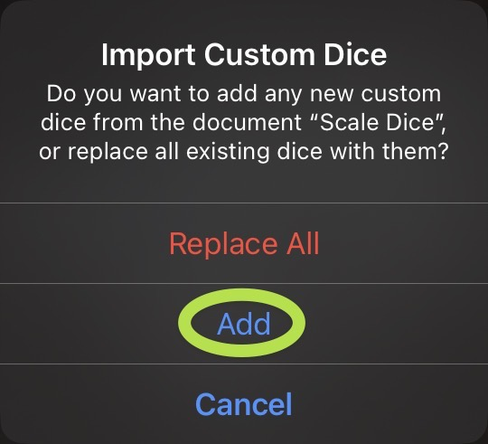

Just last week, James Thomson [celebrated 30 years of PCalc](https://pcalc.com/thirty).

I’ve been a user of his apps since getting my grandmother an iPad and wanting her to have a calculator.[1](#fn-307-1 "Read footnote.") PCalc proved to be the best choice, because it remarkably customizable. Many of its power features (like RPN and custom variables) weren’t needs I had by any stretch of the imagination, but setting up a layout with only the essential buttons with fully customizable sizes was a great fit.

Impressed with PCalc, I picked up his [Dice app](https://pcalc.com/dice/index.html) when it came out, not knowing what I’d use it for. At the time, I wasn’t regularly playing any tabletop games. Back when I was playing them in-person, I’d be loathe to give up physical dice (especially when I have a collection that is as large as it is). In the last year or so, I’ve started doing some online sessions of [WFRP](https://en.wikipedia.org/wiki/Warhammer_Fantasy_Roleplay) 4th edition, and using the dice rolling built into a [virtual tabletop](https://foundryvtt.com) saves not just time, but means the system can do a lot of rules/math auto-calculations for you.

But an idea came to me the other day for making use of this app, and I want to share what I’ve come up with.

I’ve known many directors over time to use “scale dice” to help students practice their major scales with an element of randomness. In Iowa, this is a useful preparation for All-State auditions, but it can be a handy thing to do in sectionals and small-group lessons too. Dice by PCalc has support for custom dice, and these wind up looking great.

Currently, the app supports six distinct dice designs on screen at a time (so it would be easy and practical to have six different students at once get assigned a scale with a single roll)

You can configure these dice yourself, but I’ll save you the work by sharing my “custom dice” export [here](https://github.com/mrehler/ehler-blog-files/raw/main/dice/Scale%20Dice.customdice).[2](#fn-307-2 "Read footnote.")

## How to Use These

These are instructions for using them on the Mac where keyboard shortcuts can save you a lot of time. It works just fine on iPhone and iPad, but it’s a little less nimble unless you have an iPad keyboard.

- You get six different slots for a style/configuration (no more)
- Switch between them with `⌥1-6`
- Randomly select a style for that slot with `m`
    - Will override the style for that slot, so if you have a die on the board of that style, it will change it
    - If you prefer to set a specific style, you can do so by using the style dropdown menu, or tapping on the dice colors on the top of the screen on iOS.
- Once you have scale dice loaded, hitting `8` on the keyboard will throw one of whichever slot you have selected
    - Hit the `…` button on the left to select the scale dice.
- You can add as many to roll at once as you like
- The Space bar will reroll them all at once

## How to Import These

After downloading the [custom dice](https://github.com/heyhler/ehler-blog-files/raw/main/dice/Scale%20Dice.customdice) file, you should just be able to open it and it will open up Dice by PCalc. Then just hit add. If it’s not loading by just opening the .customdice file, open the custom dice pane yourself (the `…` button on the left), click “Edit” and the select the folder icon on the bottom left of the pane.

## On Rhythm Dice

While I don’t really have a use for them.[3](#fn-307-3 "Read footnote.") I know a lot of general music teachers like to use rhythm dice of one form or another. I tried my hand at creating some, but they don’t really work all that well. Dice by PCalc is able to support any unicode character and [SFSymbols](https://developer.apple.com/sf-symbols/). It’s not, however, able to support a separate [font entirely](https://www.notationcentral.com/product/musglyphs/). Unicode has many different musical glyphs (which you can view with `⌃⌘Space`), but they tend to render kind of strangely. When playing with it, a handful of the glyphs just didn’t render well (or right together) on the dice. I assume this is because of font mapping of these characters.[4](#fn-307-4 "Read footnote.")

I’m hopeful that SF Symbols adds support for more music notation glyphs in the future, and if it does, that might open the door for some rhythm dice here.

* * *

1. At time of writing, I thought a more recent iPadOS version had finally added a stock calculator – but there still isn’t one. PCalc, then, is my top recommendation in this space! [↩](#fnref-307-1 "Return to main content.")
2. Eagle-eyed readers might notice that this link is not pointing to Dropbox, but to Github. I am most of the way through a project to migrate everything I’ve previously shared on this blog from Dropbox to Github. [↩](#fnref-307-2 "Return to main content.")
3. I also don’t have that much of a use for these scale dice myself, actually, but I don’t let that stop me from writing [↩](#fnref-307-3 "Return to main content.")
4. The offending characters in question were 𝄽, ♪, and 𝄾 for those particularly curious. The weird rendering you’re _probably_ seeing in your browser for them is a good indication of why they’re so weird on the dice [↩](#fnref-307-4 "Return to main content.")
